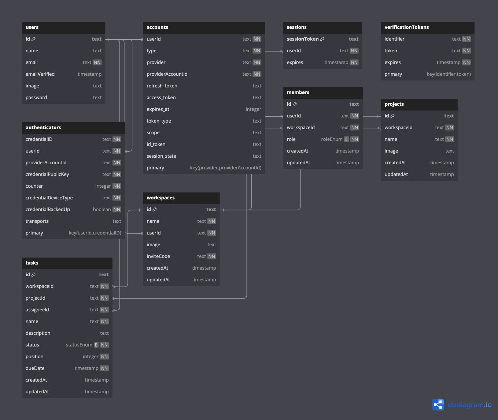

# About

Planit is Full stack project & task management web application using with React, Next.js, Typescript, NextAuth, TailwindCSS, Drizzle ORM, PostgreSQL, React-query, Hono.js, Cloudinary, Zustand,

### Key Technologies

```
Frontend: React, Next.js, TypeScript, TailwindCSS, React Query
Backend: Hono.js, Typescript
Database: Drizzle ORM, PostgreSQL
Auth: NextAuth
State Management: Zustand
Image Hosting: Cloudinary
```

### Default workspace join url

```

```

### Database ORM

```

```

### Features

```
- Workspaces: Create, edit, delete, reset join codes, and join workspaces.
- Projects: Add, modify, and delete projects within each workspace.
- Tasks: Create, update, and remove tasks with a Kanban board view.
- User Management: Update user details and manage account settings.
- File Management: Seamless image upload and storage.
```

### Install packages

```shell
npm istall
```

### Setup .env file

```js
NEXT_PUBLIC_APP_URL=http://localhost:3000

AUTH_SECRET="AUTH SECRET"

NEXT_PUBLIC_DATABASE_URL=

AUTH_GITHUB_ID=
AUTH_GITHUB_SECRET=

AUTH_GOOGLE_ID=
AUTH_GOOGLE_SECRET=

NEXT_PUBLIC_CLOUDINARY_CLOUD_NAME=
NEXT_PUBLIC_CLOUDINARY_API_KEY=
NEXT_PUBLIC_CLOUDINARY_API_SECRET=
```

### Start the app

```shell
npm run dev
```

## Available commands

Running commands with npm `npm run [command]`

| command | description                              |
| :------ | :--------------------------------------- |
| `dev`   | Starts a development instance of the app |
